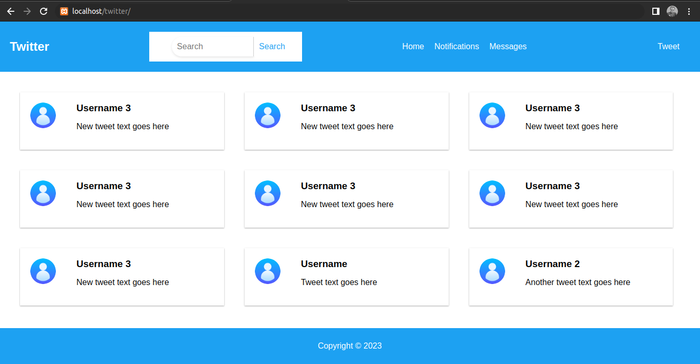

# Twitter Homepage Clone

This is a simple clone of the Twitter homepage, built with **HTML**, **CSS**, and **JavaScript**. It includes a header with a search bar and button, a menu section with links, and a responsive design that adjusts to the device's screen size.

## How to run the code

To run the code, simply open the HTML file in a web browser. The CSS and JavaScript files are linked to the HTML file, so they will be loaded automatically.

## Features

- Responsive design that adjusts to the device's screen size
- Search bar with placeholder text and submit button
- Menu section with links
- Clean and simple design

## Screenshot

## Technologies Used

- HTML
- CSS
- JavaScript

## Contributions

If you'd like to contribute to this project, simply fork the repository, make your changes, and submit a pull request.

## License

This project is licensed under the MIT License. See [LICENSE](https://choosealicense.com/licenses/mit/) for more information.
